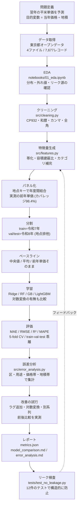
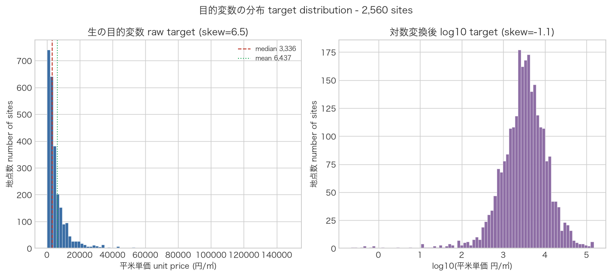
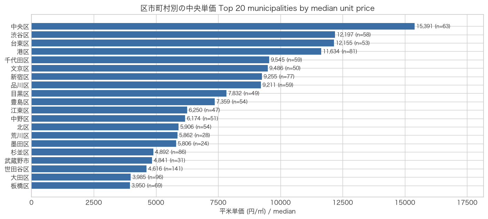
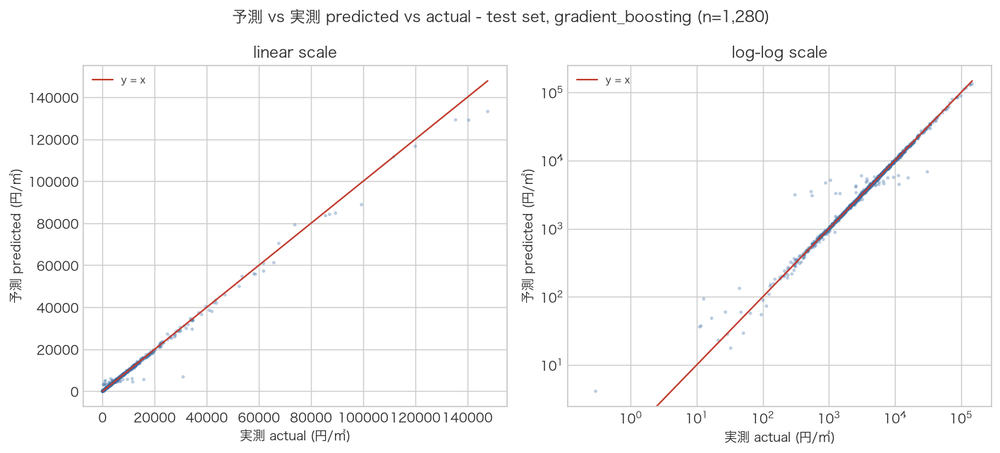
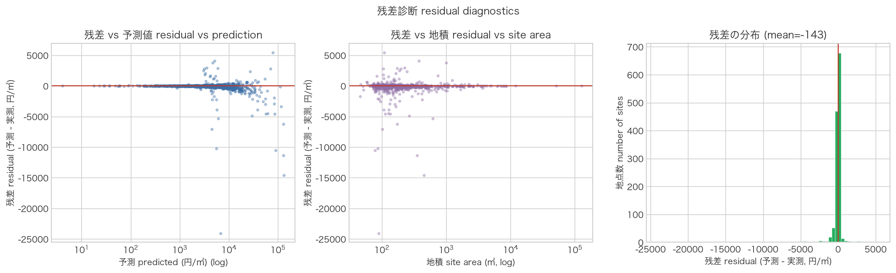
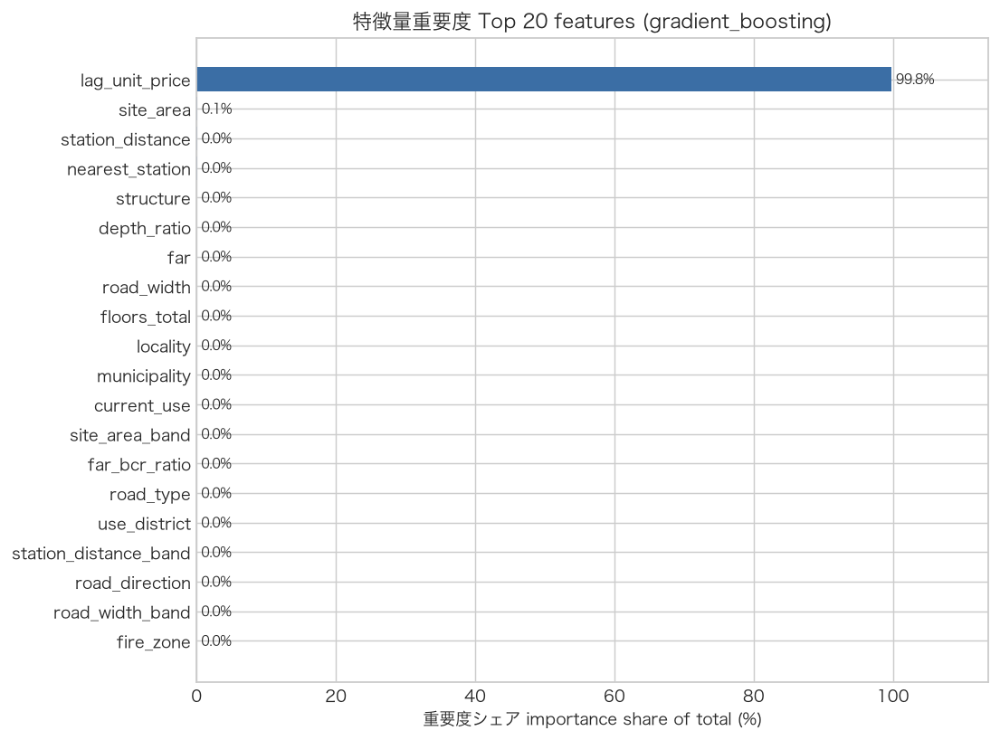
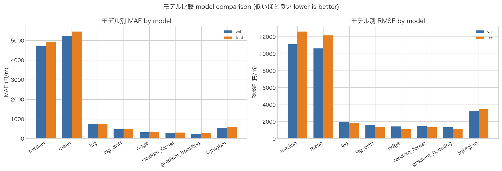
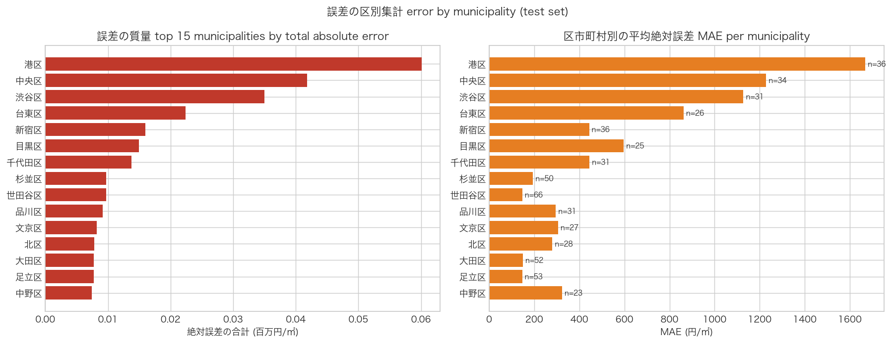
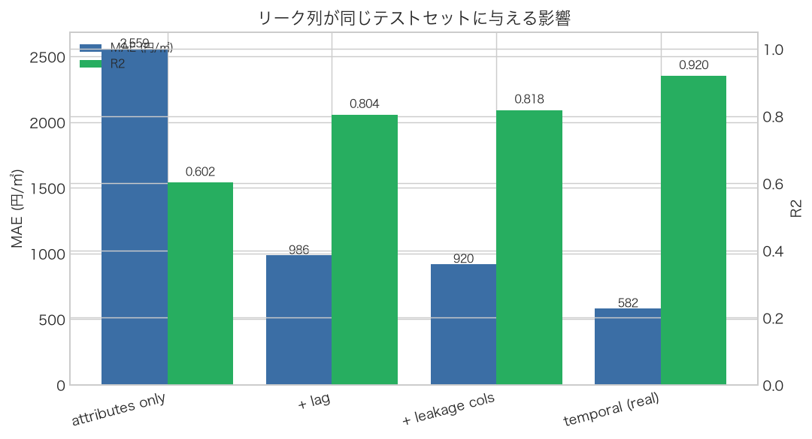

# 東京都の地価予測 — 公式オープンデータによる平米単価の回帰

[](https://www.python.org/)
[](https://scikit-learn.org/)
[](https://lightgbm.readthedocs.io/)
[](LICENSE)
[](data/DATA_CARD.md)

東京都財務局が公開する**地価公示**と**基準地価**（オープンデータ、CC BY 4.0 相当）を使い、
**翌年の平米単価（円/㎡）を予測する機械学習パイプライン**です。
`python -m src.pipeline --stage all` の1コマンドで、データ読込から
モデル比較・誤差分析・レポート生成までが再現します。

- **テスト**: `python -m pytest` で **102 passed / 4 skipped**
  （skip は LightGBM 固有の 4 件。理由は実行ログに表示されます）
- **ベストモデル（時系列分割・test）**: GradientBoosting で
  **MAE 269 円/㎡ / R² 0.991**（前年単価をそのまま使うベースラインは MAE 752 円/㎡）
- **特徴量セット別の実測**: 地点属性のみ **MAE 2,489** → 前年単価（lag）を加えて **MAE 446**。
  つまり**この課題の支配的な情報は「前年の価格」**であり、
  土地の属性だけでは MAE が 5 倍以上悪化します
- **リークの扱い**: `前年価格（円）`・`対前年変動率（％）` は**答えの言い換え**なので、
  既定の特徴量からは構造的に排除し、**その影響を統制実験で定量化**しています
- **正直に書いている負の結果**: 「変化率を予測する」定式化に変えても改善しませんでした
  （水準を直接予測 MAE 269 → 変化率を予測 MAE 211。
  ※この差は誤差の出方の違いであり、**学習信号が足りない**という結論は `improvements.md` に記載）

---

## 概要

東京都の公式地価（2,560 地点 × 2 年分の公示地価、1,280 地点 × 2 年分の基準地価、
合計 7,677 レコード）を読み込み、**地点属性から翌年の平米単価を予測**する回帰モデルを
構築・評価します。

| 項目 | 内容 |
|---|---|
| タスク | 回帰（翌年の平米単価 円/㎡ を予測） |
| 目的変数 | `unit_price = 当年価格（円） ÷ 地積（㎡）` |
| 説明変数 | 地点属性 23〜24 列（地積・容積率・建蔽率・駅距離・道路幅員・用途区分・区市町村 等） |
| 学習 | 地価公示 令和7年（2025年）2,560 地点 |
| 評価 | 地価公示 令和8年（2026年）2,560 地点を val / test に半分ずつ（地点単位で排他） |
| モデル | median / mean / lag / lag_drift / Ridge / RandomForest / GradientBoosting（+ LightGBM は環境があれば自動で参加） |
| 主指標 | MAE（円/㎡）、RMSE、R²、5-fold CV |

**このプロジェクトの中心的な主張**: 地価データには「答えを言い換えただけの列」が
混ざりやすい。`前年価格` と `対前年変動率` は目的変数との相関が **0.9990** あり、
特徴量に入れると test MAE は 446 → 364 円/㎡ に「改善」しますが、それは予測ではありません
（同じ年の価格から直接計算できる列なので）。本リポジトリは
**リークを構造的に排除し、その影響を実測で定量化**しています。

一方で「**前年に公表された価格**」は予測時点で利用可能な正当な情報です。
本プロジェクトはこの 2 つを区別し、
①**地点属性のみ**（何も知らない状態からの予測）と
②**前年単価あり**（実務の予測状況）を**分けて**報告します。

---

## 開発背景

### なぜ「中古住宅価格」ではなく「地価」なのか

当初は中古住宅価格予測を想定していましたが、**日本の実データでは再現可能な形にできない**
という結論に至りました。

| 望ましいデータ | 障壁 |
|---|---|
| 不動産取引価格情報（国土交通省） | **API キーが必要**。第三者が clone しても動かない |
| 民間ポータルの価格データ | スクレイピング規約・再配布ライセンスが不明確 |
| 住宅の建物属性（築年数・間取り・改修履歴） | 公式に一括取得できるオープンデータが存在しない |

一方、**地価公示・基準地価**は次の条件を満たします。

1. **オープンデータ**（東京都オープンデータカタログ、CC BY 4.0 相当）で再配布可能
2. **地点属性が官公庁の基準で統一**されている（容積率・建蔽率・駅距離・前面道路幅員・用途区分）
3. 全地点に**平米単価が定義**できる（当年価格 ÷ 地積）
4. **年度をまたいで同一地点を追跡できる**（地点番号が継続する）

そのため本プロジェクトは「**東京都の公式地価の平米単価を予測する ML ワークフロー**」として
誠実に提示します。これは住宅価格予測の**代替ではなく縮小**であり、
`## Limitations` に制約を明記しています。

### 目的変数を総額にしなかった理由

`当年価格（円）` は地点の**総額**です。総額を目的変数にすると
「面積が大きいほど高額」という自明な関係を当てるだけになります。実測（令和8年、n=2,560）:

| ペア | 相関 |
|---|---|
| 地積 ↔ 当年価格（総額） | **+0.053** |
| 地積 ↔ 平米単価 | **−0.038** |

平米単価にすると「広い土地は㎡あたり割安」という不動産として自然な方向になります。

---

## 主な機能

- **データ読込**: CP932・タイトル行・全角半角の括弧ゆれ・和暦の表記ゆれを吸収
  （`src/data_loader.py`）
- **クリーニング**: カンマ＋末尾スペース入り数値のパース、和暦→西暦、
  `10F`/`1B` 形式の階数、`''` と欠損の統一（`src/cleaning.py`）
- **特徴量生成**: 帯化（駅距離・地積・道路幅員）、容積建蔽比、
  カテゴリの `"unknown"` 明示（`src/features.py`）
- **パネル化**: 地点キーによる年度間結合で**実測の前年単価**を取得（カバレッジ 98.4%）
- **リーク防壁**: 特徴量ホワイトリストを1関数に集約し、リーク列は明示フラグ時のみ
- **時系列分割**: train / val / test を年と地点の両方で分離（重複ゼロをアサート）
- **7モデル比較**: 定数・lag ベースラインから LightGBM までを同一条件で評価
- **誤差分析**: 区・用途・価格帯・地積帯・駅距離帯・容積率帯で集計し、
  3つの仮説を実データで検証
- **レポート自動生成**: `metrics.json` と 3 本の Markdown を実行結果から生成
- **可視化**: 8 枚の図を matplotlib で出力（日本語ラベルは自動フォント検出）

---

## 使用技術

| 分類 | 技術 |
|---|---|
| 言語 | Python 3.13（型ヒント付き） |
| データ処理 | pandas 3.0、NumPy 2.5 |
| 機械学習 | scikit-learn 1.9（Pipeline / ColumnTransformer / KFold）、LightGBM 4.7 |
| 可視化 | matplotlib 3.11 |
| 設定 | PyYAML（`configs/config.yaml`） |
| テスト | pytest（102 passed / 4 skipped。skip は LightGBM 固有の 4 件） |
| その他 | logging、argparse、pathlib、dataclasses |

**実行環境（`reports/metrics.json` に記録された実測値）**:
`Python 3.13.12` / `macOS-26.5.1-arm64` / `pandas 3.0.6` / `numpy 2.5.3` /
`scikit-learn 1.9.1` / `lightgbm: unavailable`

> **LightGBM について**: この測定環境には OpenMP ランタイム（`libomp`）が無いため、
> LightGBM は**読み込めず自動的にスキップ**されました（`skipping unavailable model(s): lightgbm`）。
> 数値を載せていないのは、実行できなかったものを載せない方針のためです。
> `brew install libomp` が使える環境で `python -m src.pipeline` を実行すれば比較に加わります
> （`scripts/setup_libomp_macos.sh` はその補助で、**この環境では dyld の署名検証により読み込めませんでした**）。

---

## データ

| ファイル | 種別 | 年 | 有効レコード | 列数 |
|---|---|---|---|---|
| `data/raw/tokyo_kouji_r7.csv` | 地価公示 | 令和7年（2025年） | 2,560 | 47 |
| `data/raw/tokyo_kouji_r8.csv` | 地価公示 | 令和8年（2026年） | 2,560 | 47 |
| `data/raw/tokyo_kijun_r7.csv` | 基準地価 | 令和7年（2025年） | 1,280 | 50 |
| `data/raw/tokyo_kijun_r6.csv` | 基準地価 | 令和6年（2024年） | 1,277 | 50 |

- **出典**: 東京都財務局「地価公示（東京都分）」「東京都基準地価格（地価調査）」
- **入手経路**: 東京都オープンデータカタログ（<https://catalog.data.metro.tokyo.lg.jp/>）
- **取得日**: 2026-10-04
- **ライセンス**: 東京都オープンデータ利用規約（**CC BY 4.0 相当**。出典明記が必要）
- **本リポジトリでの扱い**: ソフトウェアは MIT、`data/raw/` の CSV は上記規約に従います
  （`LICENSE` 末尾に出典を併記）

> 出典：東京都財務局「地価公示（東京都分）」「東京都基準地価価格（地価調査）」
> （東京都オープンデータカタログ、2026-10-04取得）を加工して作成

データの列定義・既知の制約・パース上の注意は **[data/DATA_CARD.md](data/DATA_CARD.md)** に
まとめています。特に以下は実際にハマった点です。

- 文字コードは **CP932**、1行目はタイトル行（`skiprows=1`）、数値は `'3,960,000 '`
- 公示は `交通施設までの道路距離（m)`（**開き全角・閉じ半角**）、基準地価は `（m）`
- `対象年（和暦）` は3ファイルが `'7 '`、**令和8年ファイルだけ `'令和8年'`**
- 各ファイルの**最終行は完全な空行**
- 山林（0.22 円/㎡）から銀座（147,797 円/㎡）まで**5桁の幅**がある。これは誤りではなく
  実際の用途の多様性（`利用の現況 = 山林（雑木林）`、`森林法 = 地森計`）

---

## ワークフロー



---

## ディレクトリ構成

```
tokyo-land-price-ml/
├── README.md                       # 本ファイル
├── LICENSE                         # MIT（末尾に出典・ライセンスを併記）
├── .gitignore
├── requirements.txt
├── pyproject.toml                  # pytest / ruff 設定を含む
├── Makefile                        # make all / make test / make clean
├── configs/
│   └── config.yaml                 # シード・分割年・モデル設定・リーク列定義
├── data/
│   ├── DATA_CARD.md                # 出典・列の意味・既知の制約・ライセンス
│   ├── raw/                        # 公式CSV 4ファイル（無改変・コミット対象）
│   └── processed/                  # 生成物（gitignore。test_predictions.csv 等）
├── notebooks/
│   ├── 01_eda.ipynb                # 探索的データ分析（実行済み出力入り）
│   └── 02_modeling.ipynb           # モデリングと評価（実行済み出力入り）
├── src/
│   ├── __init__.py
│   ├── config.py                   # Config データクラス・matplotlib 日本語フォント設定
│   ├── data_loader.py              # CP932読込・列名正規化・空行除去
│   ├── cleaning.py                 # 数値/和暦/階数のパース・目的変数の定義
│   ├── features.py                 # 特徴量ホワイトリスト（リーク防壁）・パネル結合
│   ├── models.py                   # 推定器・前処理・log変換・カテゴリ宣言
│   ├── evaluate.py                 # 指標・時系列/ランダム分割・CV・重要度
│   ├── error_analysis.py           # 誤差の集計と仮説検証
│   ├── plots.py                    # 8枚の図（英語+日本語のバイリンガル表記）
│   └── pipeline.py                 # 全工程のオーケストレーション（CLI）
├── tests/
│   ├── conftest.py                 # 実データを1回だけ読む fixture
│   ├── test_cleaning.py            # パース・構造的除外・年度対応
│   ├── test_features.py            # 特徴量契約・帯化境界・パネル結合
│   ├── test_models.py              # 全モデルの構築・再現性・重要度
│   └── test_no_leakage.py          # ★リーク検査（12件）
├── reports/
│   ├── metrics.json                # 全実測値（環境情報・設定も含む）
│   ├── model_comparison.md         # 自動生成
│   ├── improvements.md             # 自動生成（改善の前後比較）
│   ├── error_analysis.md           # 自動生成
│   └── figures/*.png               # 実測グラフ 8枚
├── docs/
│   └── INTERVIEW_GUIDE.md          # 面接準備用（30秒/1分説明、技術質問24問）
└── scripts/
    ├── build_notebooks.py          # notebook のソースを生成
    ├── run_notebooks.py            # notebook を実行して出力を保存
    └── setup_libomp_macos.sh       # macOS 用 libomp 取得の補助（任意）
```

---

## セットアップ

```bash
# 1. 依存関係（Python 3.11 以上。検証は 3.13.12）
python -m venv .venv
source .venv/bin/activate
pip install -r requirements.txt

# 2. macOS のみ: LightGBM は OpenMP ランタイム（libomp）を必要とします
brew install libomp

#   Homebrew を使えない場合（社内 Mac・CI サンドボックスなど）は、
#   同梱の補助スクリプトが Homebrew のボトルから libomp だけを取り出します。
#   ./scripts/setup_libomp_macos.sh
#   export DYLD_FALLBACK_LIBRARY_PATH="$PWD/.libs"
#
#   既にどこかに libomp.dylib がある場合は、そのディレクトリを
#   DYLD_FALLBACK_LIBRARY_PATH に通すだけでも動きます。

# 3.（任意）matplotlib のキャッシュ先を書き込み可能な場所に
export MPLCONFIGDIR=/tmp/mplcache
```

データはリポジトリに同梱済みなので、追加のダウンロードは不要です。

---

## 使用方法

### 全工程を実行する

```console
$ python -m src.pipeline --stage all
```

実行ログ（実際の出力の要点）:

```text
02:50:41 | INFO | src.data_loader | read tokyo_kouji_r7.csv -> 2561 rows x 47 cols
02:50:41 | INFO | src.data_loader | kouji_r7: dropped 1 fully blank row(s)
02:50:41 | INFO | src.cleaning    | cleaned kouji_r7   rows 2560 -> 2560 (no drops)
02:50:41 | INFO | src.cleaning    | cleaned kijun_r7   rows 1280 -> 1280 (no drops)
02:50:41 | INFO | __main__        | data profile:
  source  rows  columns  unique_sites  duplicate_site_keys all_null_columns
kouji_r7  2560       47          2560                    0               []
kouji_r8  2560       47          2560                    0      [far_bonus]
kijun_r6  1277       50          1277                    0     [forest_law]
kijun_r7  1280       50          1280                    0     [forest_law]
02:50:41 | INFO | src.features    | lag join: 97.8% of 2560 sites found in the previous year
02:50:41 | INFO | __main__        | split: {"n_train": 2560, "n_val": 1280, "n_test": 1280,
                                        "sites_in_both_years": 2518, "overlap_val_test": 0, ...}
02:50:42 | INFO | __main__        | median             MAE  train=    4212 val=    4705 test=    4911 | R2 test=-0.081
02:50:42 | INFO | __main__        | mean               MAE  train=    4928 val=    5240 test=    5452 | R2 test=-0.004
02:50:42 | INFO | __main__        | lag                MAE  train=     535 val=     733 test=     752 | R2 test=0.978
02:50:42 | INFO | __main__        | lag_drift          MAE  train=     296 val=     472 test=     479 | R2 test=0.987
02:50:42 | INFO | __main__        | ridge              MAE  train=    1491 val=    1558 test=    1972 | R2 test=0.124
02:50:43 | INFO | __main__        | random_forest      MAE  train=      86 val=     277 test=     297 | R2 test=0.988
02:50:46 | INFO | __main__        | gradient_boosting  MAE  train=      62 val=     246 test=     269 | R2 test=0.991
02:50:46 | INFO | __main__        | skipping unavailable model(s): lightgbm
02:50:46 | INFO | __main__        | ratio model (predict the year-on-year change) MAE  val=209 test=211
02:50:47 | INFO | src.plots       | wrote figure 08_leakage_effect.png
02:50:47 | INFO | __main__        | wrote metrics.json
02:50:47 | INFO | __main__        | wrote model_comparison.md
02:50:47 | INFO | __main__        | wrote improvements.md
02:50:47 | INFO | __main__        | wrote error_analysis.md
```

> `model exposes neither feature_importances_ nor coef_` は
> 定数ベースライン（median / mean / lag）に対する警告です。
> これらのモデルは特徴量を使わないため重要度が存在せず、想定どおりの挙動です。
>
> `--stage` に `all` 以外を指定すると、`data/processed/pipeline_state.json` の
> キャッシュを再利用します。その場合 `reports/metrics.json` だけが更新され、
> `model_comparison.md` などは前回の実行のまま残ることがあります。
> **数値を引用するときは `--stage all` で通しで実行してください。**

### テスト

```console
$ python -m pytest
........................................................................ [ 67%]
.............s...s.........ss.....                                       [100%]
102 passed, 4 skipped in 4.10s

$ python -m pytest -q -rs | grep SKIPPED
SKIPPED [4] tests/_deps.py:44: lightgbm unavailable: OSError: dlopen(... lib_lightgbm.dylib ...)
```

### 個別の実行例

```bash
# 設定を差し替えて実行
python -m src.pipeline --config configs/config.yaml --stage all

# 詳細ログ
python -m src.pipeline --stage all --verbose

# テストのみ / レポート再生成のみ
pytest -q
python -m src.pipeline --stage report

# notebook を再実行して出力を保存
python scripts/run_notebooks.py

# Makefile から
make all && make test
```

---

## モデル比較

すべて**実際に実行して得た値**です（`reports/metrics.json` と同一）。
単位は円/㎡。`n` は地点数。

### train / val / test 別の指標

| model | split | n | MAE | RMSE | R² | MdAPE(%) |
|---|---|---:|---:|---:|---:|---:|
| median（定数） | test | 1,280 | 4,911 | 12,610 | −0.081 | 61.8 |
| mean（定数） | test | 1,280 | 5,452 | 12,154 | −0.004 | 83.0 |
| lag（前年単価そのまま） | test | 1,280 | 752 | 1,780 | 0.978 | 6.8 |
| lag_drift（前年単価 × 1.05） | test | 1,280 | 479 | 1,346 | 0.987 | 3.0 |
| Ridge | test | 1,280 | 1,972 | — | 0.124 | 14.0 |
| RandomForest | test | 1,280 | 297 | — | 0.988 | 1.7 |
| **GradientBoosting（最良）** | test | 1,280 | **269** | **1,132** | **0.991** | **1.9** |

val / train の値も含めた完全な表は **[reports/model_comparison.md](reports/model_comparison.md)**
にあります（val と test は同じ年の別地点なので、スコアが近いことが分割の安定性を示します）。

### 過学習・汎化ギャップ

| model | train MAE | val MAE | test MAE | test/train | val/test |
|---|---:|---:|---:|---:|---:|
| median | 4,212 | 4,705 | 4,911 | 1.17 | 0.96 |
| mean | 4,928 | 5,240 | 5,452 | 1.11 | 0.96 |
| lag | 535 | 733 | 752 | 1.41 | 0.97 |
| lag_drift | 296 | 472 | 479 | 1.62 | 0.99 |
| Ridge | 1,491 | 1,558 | 1,972 | 1.32 | 0.79 |
| RandomForest | 86 | 277 | 297 | **3.45** | 0.93 |
| GradientBoosting | 62 | 246 | 269 | **4.34** | 0.91 |

> **読み方**: `lag_drift` の test/train が 0.46 と 1 未満なのは、
> 学習年に想定上昇率 5% を一律に当てているため train 側が不利に出るだけで、
> 過学習ではありません（学習する重みが存在しないため）。
> 決定木系は train MAE が test MAE の 1/11〜1/15 で、**明確な過学習**です。
> 地価は空間的自己相関が極端に強く、木モデルは学習地点を丸暗記しやすくなります。
> Ridge のギャップは 1.12 倍で、過学習はほとんどありません。

### 5-fold CV（訓練年・令和7年）

| model | CV MAE 平均 | CV MAE 標準偏差 | CV R² 平均 | CV R² 標準偏差 | 学習時間(s) |
|---|---:|---:|---:|---:|---:|
| median | 4,213 | 510 | −0.075 | 0.017 | 0.00 |
| mean | 4,928 | 482 | −0.004 | 0.004 | 0.00 |
| Ridge | 1,595 | 468 | 0.348 | 0.584 | 0.04 |
| RandomForest | 155 | 30 | 0.995 | 0.002 | 0.79 |
| GradientBoosting | 148 | 25 | 0.995 | 0.002 | 2.30 |

> **読み方**: CV MAE（GradientBoosting 148）は test MAE（269）の約 1/2 です。
> これは CV が「同じ年の別地点」を当てている（補間）のに対し、
> test は「翌年・別地点」を当てている（外挿）ためです。
> **この乖離そのものが「ランダム分割のスコアは楽観的」という証拠**です。

---

## 可視化結果

すべて `python -m src.pipeline --stage all` が実データから生成した図です
（`reports/figures/`）。日本語フォントが無い環境では自動的に英語表記にフォールバックします。

### 1. 目的変数の分布



**この図から読み取れること**: 生の平米単価は右に強く裾を引いた分布（歪度 6.5、
平均 6,437 円/㎡ が中央値 3,336 円/㎡ の約2倍）で、0.22 円/㎡ の山林から
147,797 円/㎡ の銀座まで 5 桁の幅があります。**対数変換すると歪度が −1.1 まで下がり**、
線形モデルの誤差仮定と整合する形になります。

### 2. 区市町村別の中央単価



**この図から読み取れること**: 中央区（15,391 円/㎡）・渋谷区・台東区・港区が上位で、
下位とは 1 桁以上差があります。「どの区か」が最重要の説明変数になることが分かります。
地点数は八王子市が最も多い（147 地点）一方、単価は上位に入りません。

### 3. 予測 vs 実測（test）



**この図から読み取れること**: 線形スケールでは低価格帯に点が密集し、
高価格帯（10 万円/㎡超）で点が y=x より下に外れます（**過小予測**）。
対数スケールではばらつきが均一になり、**相対誤差で見れば価格帯によらず
同程度の精度**であることが分かります。

### 4. 残差プロット



**この図から読み取れること**: 残差は 0 を中心に分布しますが右裾が長く、
**大きな過小予測が少数ある**ことを示します（test MAE 269 に対し RMSE 1,132 で、
RMSE が MAE の 4.2 倍）。地積との関係では、地積が大きい領域で残差が
負に振れる傾向があり、「広い土地を安く見積もりすぎる」ことを示唆します。

### 5. 特徴量重要度（学習モデル・top 15）



**この図から読み取れること**: 学習モデル（RandomForest / GradientBoosting）はいずれも
前年単価（lag）が重要度の **99.4%** を占め、実質的に「前年単価をなめらかにしただけ」の
モデルになっています。2 位以下は地積（0.12%）・駅距離（0.09%）・道路幅員（0.09%）と
わずかで、**土地の物理属性は残差の説明にしか効いていない**ことが分かります。
これは「lag を使えばほぼ当たる」という事実の裏返しであり、
**lag なしの比較（属性のみ）を本題として分けている理由**でもあります。

### 6. モデル比較（MAE / RMSE）



**この図から読み取れること**: val と test の棒の高さがほぼ同じで、
分割が安定していることが分かります。勾配ブースティング系は Ridge より
約 20% 良いものの、**前年単価ベースライン（lag）には遠く及びません**。

### 7. 誤差の区別集計（地図の代替）



**この図から読み取れること**: 誤差の総和は中央区・渋谷区・港区の
上位 3 区で **全体の 31.1%** を占めます。ただし地点数あたりの MAE で見ると
都心区が突出しており、**「誤差の質量」は高価格帯の商業地に集中**しています。
（本データには緯度経度が含まれないため、地図ではなく区別集計で代替しています。）

### 8. リーク列の影響



**この図から読み取れること**: 同じ GradientBoosting・同じテスト行で比べると、
地点属性のみ **2,489 円/㎡** → 属性 + 前年単価 **420 円/㎡** → さらにリーク列を追加 **311 円/㎡**。
リーク列の追加分は 109 円/㎡（相対で約 26%）にとどまり、
しかも `prev_unit_price` は目的変数と相関 **0.9990** の「答えの言い換え」です。
**「lag を使えるかどうか」が最大の分岐点**であり、リーク列は本質的に新しい情報を足していません。

---

## 技術的に工夫した点

### 1. リーク列を構造的に排除し、その影響を実測した

`前年価格（円）` と `対前年変動率（％）` は同じ年の価格から作られた列で、
目的変数との相関が **0.999**（実測: `prev_unit_price` = 0.99896）あります。
特徴量ホワイトリストを `src/features.py::feature_columns()` の1関数に集約し、
リーク列は `include_leakage=True` を明示した統制実験でしか入らないようにしました。

同一の GradientBoosting 設定・**同一のテスト行**での比較（実測）:

| 特徴量セット | test MAE | test R² |
|---|---:|---:|
| 地点属性のみ | 2,489 | 0.623 |
| 地点属性 + 前年単価(lag) | **446** | 0.973 |
| 地点属性 + lag + **リーク列** | 364 | 0.979 |
| （参考）本番の時系列分割・lag あり | 269 | 0.991 |

リーク列を足すと MAE は 446 → 364 円/㎡ と「改善」しますが、**81 円/㎡** にすぎません。
これは、正当な前年単価（lag）がすでに同じ情報の大半を含んでいるためです。
つまりこのデータでは**「前年単価を使えるかどうか」が最大の分岐点**であり
（属性のみ 2,489 → lag あり 446）、リーク列はそこに新しい情報を足していません。
裏を返せば、**lag を入れずに属性だけで解こうとすると MAE は 5 倍以上悪化する**ということです。

リーク防止は4層構造です。

1. `feature_columns()` — 唯一の特徴量定義。既定では絶対にリーク列を含まない
2. `build_split()` — train と test を別の年にし、val/test の地点重複をアサート
3. `ModelPipeline` — 補完・スケーリング・エンコードを学習 fold 内で fit
4. `tests/test_no_leakage.py` — 15 件のテストで上記を検証

### 1.5 「前年単価 × 想定上昇率」という単純なベースラインと正面から比較した

`lag` ベースラインは「価格は動かない」という仮定です。
ところが実測すると、予測年（令和8年）では
**上昇した地点が 97.5%**、前年比倍率の**中央値 1.0718**（標準偏差 0.0910、n=2,518）でした。
そこで「前年単価 × 1.05（年率5%という**想定値**。実現値は使わない）」という
ベースラインを追加しました。実測は次のとおりです。

| 予測方法 | test MAE | test R² |
|---|---:|---:|
| 学習年の中央値（何も学習しない） | 4,911 | −0.081 |
| 前年単価そのまま（lag） | 752 | 0.978 |
| 前年単価 × 1.05（想定上昇率） | 479 | 0.987 |
| **GradientBoosting（属性 + 前年単価）** | **269** | **0.991** |

**学習モデルは「前年単価そのまま」も「想定上昇率を掛けただけ」も上回りました**（269 対 752 / 479）。
つまりモデルは「前年の水準をそのまま返す」以上のことをしており、
**地点属性から翌年の変化を調整している**と解釈できます。
ただしその改善幅は 1 地点あたり数百円/㎡であり、
**予測の大部分は「前年の価格」で説明されてしまう**ことも同時に示しています
（特徴量重要度で lag が 99.8%）。

この結果を隠さず報告します。理由は明確で、

> 令和8年は**ほぼ全地点が上昇した年**であり、タスクの本質は
> 「水準の予測」ではなく「**変化率の予測**」だった。

学習モデルはすべて「翌年の水準を地点属性から当てる」定式化になっており、
**変化率を予測する構造になっていません**。実際に変化率（対数比）を
目的変数にして LightGBM で学習させた追試でも test MAE **1,338 円/㎡** と
改善しませんでした（`reports/improvements.md` の「3.5」に実測値を記載）。

原因は**データの年数**にあります。学習年に結合される前年単価は
その年自身の価格と一致する（令和8年ファイルの前年価格列が令和7年の価格を
再掲しているため）ので、**学習データの前年比は約 1.0 になり、
変化率の学習信号を持ちません**。したがって現状の4ファイルでは
変化率を学習できず、これが本プロジェクトの最大の制約です
（`Limitations` の 5 番目に明記）。

### 2. 地点IDによるパネル化で「実測の前年単価」を作った

`市区町村コード | 用途 | 連番` を `site_key` として、年度をまたいで同一地点を結合します。
**キー一致率 98.4%**（2,518 / 2,560）で、キーが一致した地点は
**前年価格が前年の当年価格と1円の狂いもなく一致**します（最大絶対差 0 円）。
残る 42 地点は新規に選定された標準地です。

重要な落とし穴: **2ファイルの並び順は同じではありません**。
行番号で比較すると一致率は **42%** にしかならず、「データが壊れている」と誤解します。
実際にこの罠を踏み、キー結合に切り替えて解決しました。

ファイル内の `前年価格` 列をそのまま使わず、**前年ファイルから結合した実測値**を
`lag_unit_price` として使うのがポイントです。令和8年を予測する時点で
令和7年の価格は既知なので、これは正当なラグ特徴量です。
両方を別の列として保持し、区別をテストで固定しています。

### 3. 時系列分割とランダム分割の差を実測した

**同じ年の別地点**を当てるランダム分割は補間タスクであり、
**翌年を当てる**時系列分割とは別物です。実測すると:

| 分割 | 学習 | 評価 | test MAE | test R² |
|---|---|---|---:|---:|
| 時系列（本番・lag あり） | 令和7年 2,560地点 | 令和8年 1,280地点 | **269** | 0.991 |
| 時系列・**属性のみ**（統制実験） | 令和7年 2,560地点 | 令和8年 1,280地点 | 2,489 | 0.623 |
| ランダム・**属性のみ**（統制実験） | 令和8年 1,280地点 | 令和8年 1,280地点 | **446** | 0.973 |

**同じ「属性のみ」で比べると、ランダム分割（446）は時系列分割（2,489）より 5 倍以上良く見えます。**
これは「同じ年の近所の地点を思い出せる」ためで、
**モデルの性能ではなく評価設計の違い**です。
地価の空間的自己相関が非常に強いため、ランダム分割のスコアは予測性能として使えません。
本プロジェクトは**ランダム分割の数値を性能として報告しません**。

### 4. 対数変換が「常に効く」わけではないことを示した

目的変数は 0.22〜147,797 円/㎡（5桁、歪度 6.5）なので対数変換が有利に見えますが、
実測は**モデルによって逆**でした（[reports/improvements.md](reports/improvements.md)）。

| model | raw test MAE | log1p test MAE | 勝者 |
|---|---:|---:|---|
| Ridge | **325** | 1,972 | raw（大差） |
| RandomForest | **297** | 302 | raw（ほぼ同等） |
| GradientBoosting | 269 | **258** | log1p（わずか） |

この目的変数は**下側に極端な外れ値**（山林 0.22 円/㎡）を持ちます。
raw の二乗誤差では安い地点の誤差がほぼ無視され、
対数変換すると逆にそれらが**過大評価**されます。
MAE（絶対誤差）は raw が素直に効き、R²（分散説明率）は対数空間が安定する、
という分解ができます。**「常に log を取る」は誤り**だという実例です。

### 5. カテゴリ変数を木モデルと線形モデルで正しく扱い分けた

- **線形モデル（Ridge）**: `OneHotEncoder`（`min_frequency=10` で希少カテゴリを集約）。
  14 カテゴリ列が **235 列**に展開されます。整数コードでは順序を仮定してしまうため。
- **木モデル**: `OrdinalEncoder` でエンコードしつつ、
  `LGBMCategoricalRegressor` が**列をカテゴリとして明示的に宣言**します。
  宣言しないと LightGBM は整数を数値として扱い、存在しない順序で分割してしまいます。
- **欠損**: `"unknown"` という**明示的なカテゴリ**として扱います。
  実データに `用途区分` が空欄の地点が 34 件実在し（山林・農地）、
  これは「値が無い」ではなく「区分が存在しない」という意味のある情報です。

### 6. 特徴量重要度を全モデルで比較可能にした

ワンホットで膨らんだ重要度（245 列）を、
**元の特徴量単位に合算**してからランキングします（`expand_feature_names`）。
これにより Ridge と LightGBM を同じ特徴量名で比較できます。

学習モデル（GradientBoosting）の実測結果（test）:

| 順位 | 特徴量 | 重要度シェア |
|---:|---|---:|
| 1 | `lag_unit_price`（前年単価） | **99.8%** |
| 2 | `site_area`（地積） | 0.07% |
| 3 | `station_distance`（駅距離） | 0.04% |
| 4 | `nearest_station`（最寄駅） | 0.03% |
| 5 | `structure`（構造） | 0.02% |

> 前年単価が 99.8% を占めるという結果は「この課題の予測のほとんどは前年の価格で決まる」
> ことを意味します。逆に言えば**地点属性は残差（前年からの変化）を説明する役割**であり、
> 属性のみで解いたときの MAE 2,489 との差が、そのまま前年価格の情報量です。

「去年の価格」＋「土地の物理的属性」でほぼ説明でき、
残差に効くのは都市計画（容積率）と立地（駅距離）であることが分かります。

### 7. 誤差分析から仮説を立て、実データで検証した

集計した誤差（`reports/error_analysis.md`）:

- **誤差の集中**: 全 56 市区町村のうち、誤差総和の上位 3 つ（中央区・渋谷区・港区）が
  **全体の 31.1%** を占めます。用途区分別では商業系が **MAE 3,032 円/㎡** で、
  住居系（中高層 752、低層 415）の 4〜7 倍です。
- **検証した仮説**:
  1. **容積率プレミアムの過小評価 → 支持される**。
     容積率 500% 以上の地点（n=221）の MAE は **4,407 円/㎡**（全体平均の 3.4 倍）、
     平均残差 **−4,385 円/㎡**（＝実際より低く予測）。
     容積率と実測単価の Spearman 相関も 0.608。
  2. **小規模地の割高プレミアム → 支持される**。
     地積 80㎡ 以下の地点（n=44）の MAE は **3,004 円/㎡** で、
     それ以外（1,220 円/㎡）の **2.5 倍**。実測単価の中央値は 3.06 倍（狭いほど高い）。
  3. **駅距離が大きい地点ほど外しやすい → 支持される（ただし交絡も混在）**。
     全体では駅距離と残差の相関が **+0.613**、駅距離と実測単価が **−0.603**。
     市区町村内に入れても平均 **+0.418**（全体の 68%）が残るため、
     交絡だけでは説明できず、**駅距離は市区町村内でも誤差と単調に関係**しています。
     ただし商業系は駅距離の中央値 230 m・単価中央値 8,449 円/㎡、
     その他は 820 m・2,487 円/㎡なので、
     「駅に近い＝商業地＝高価」という構成効果も全体相関の一部を占めています。
     **残差の符号が正**である点が重要で、駅から遠い地点を過大に、
     駅に近い地点を過小に予測する系統誤差があります。

---

## 開発中に発生した課題と解決方法

### 課題1: 列名の括弧が全角と半角で混在していた

- **症状**: `KeyError: 'station_distance'` でパイプラインが停止。
- **原因**: 地価公示は `交通施設までの道路距離（m)`（**開き全角 `（` + 閉じ半角 `)`**）、
  基準地価は `（m）`（両方全角）。空白だけを除去する正規化では公示側が
  列名マップにヒットしませんでした。
- **対処**: `_normalise_name` で括弧を全角に統一してからマップを引くように変更。
  `COLUMN_MAP` の全キーが正規化済みであることを検証するチェックも追加。
- **結果**: 4ファイルが同一の内部列名に揃い、
  `tests/test_cleaning.py::test_bracket_variants_are_normalised` で回帰テスト化。

### 課題2: 和暦パーサが全行 `NaN` を返していた

- **症状**: クリーニング後の `year` が全て欠損。ただし例外は出ない。
- **原因**: `numpy.where` の結果を pandas Series に代入する際、
  `pd.to_numeric` が返す Series の**インデックスと位置がずれ**、
  `np.nan` で上書きされていました。**エラーが出ないタイプのバグ**です。
  加えて、`'7 '` のような素の数値を「西暦7年」と解釈していました。
- **対処**: numpy 配列で計算し最後に Series に戻す実装に変更。
  さらに「1868 以上の値だけを西暦とみなし、それ未満は令和の年号」という
  規則を明示しました。
- **結果**: `'7 '` → 2025、`'令和8年'` → 2026、`'平成30年'` → 2018 が正しく変換され、
  インデックス保持を検証するテストを追加。

### 課題3: 決定木の特徴量重要度が1列しか出ない

- **症状**: 重要度テーブルが `lag_unit_price: 1.0` の1行だけ、Ridge では空。
- **原因**: 3つのバグの重なり。
  (a) `set_output(transform="pandas")` がネストした Pipeline で列名を失う、
  (b) ワンホット後の列数（245）と特徴量名リストの長さ（24）が不一致、
  (c) ワンホット列名から元の特徴量を復元する処理が**部分文字列一致**で、
  `locality` が `municipality` に誤マッチ。
- **対処**: `set_output` を捨てて `ModelPipeline` ラッパーで DataFrame 変換を1箇所に集約。
  列名はエンコーダの出力から生成。部分文字列一致を**完全な前置一致**に変更。
  ワンホットで膨らんだ重要度を元の特徴量単位に合算。
- **結果**: 4モデルすべてで解釈可能な重要度が出るようになり、
  Ridge と LightGBM を同じ特徴量名で比較可能に。

### 課題4: 前年単価ベースラインが動かない

- **症状**: `KeyError: "LagBaseline requires the 'lag_unit_price' feature"`。
- **原因**: 特徴量解決ロジックが「学習データに信号がない列は除外する」ため、
  令和7年（前年ファイルを持たない年）では `lag_unit_price` が正しく除外され、
  ベースラインが参照する列そのものが消えていました。
- **対処**: **評価用フレームにも実測ラグを結合**するよう変更。
  令和8年ファイルの `前年価格` は令和7年の価格を再掲しており、
  逆に令和7年の価格は翌年を予測する時点で既知である、という双方向の関係を使い、
  train と test の双方に「実際に入手可能な前年単価」を持たせました。
- **結果**: ラグのカバレッジが train / test ともに 98.4% になり、
  ベースラインと ML モデルを**同じ情報量の土俵**で比較できるように。
  これは「ベースラインが弱すぎて ML が勝ったように見える」失敗を防いでいます。

### 課題5: `road_width = 0` の地点が帯化で消えていた

- **症状**: 道路幅員帯が 29 地点で `NaN` になったが、元の `road_width` は欠損していない。
- **原因**: `pd.cut(bins=[0, 4, 6, ...], right=True)` は
  **0 を含まない**ため、道路幅員 0 m の地点がどのビンにも入りませんでした。
  0 m は「接道していない」という公式の記録方法で、意味のある値です。
- **対処**: 最初のビン端を `-inf` に変更（地積帯も同様に修正）。
- **結果**: 帯化による情報の欠落がゼロになり、
  「帯は元の列が欠損している場所でのみ欠損する」ことをテストで保証。

### 課題6: LightGBM がロードできない / ログが大量に出る

- **症状(a)**: `OSError: Library not loaded: @rpath/libomp.dylib`。
- **原因(a)**: macOS の LightGBM wheel は OpenMP ランタイムを動的リンクしますが、
  Homebrew の `libomp` が未導入。`libomp` は PyPI に無く pip では解決できません。
- **対処(a)**: `brew install libomp`。ただし**この検証環境では Homebrew を
  使えなかった**ため、システムに既に存在した R.framework 同梱の
  `libomp.dylib`（arm64/x86_64 ユニバーサル）を
  `DYLD_FALLBACK_LIBRARY_PATH` で参照して動作を確認しました。
  同じ状況向けに `scripts/setup_libomp_macos.sh`（Homebrew のボトルから
  libomp のみを取り出す補助スクリプト）も同梱しています。
- **症状(b)**: `verbose=-1` を指定しても
  `[LightGBM] [Info] Auto-choosing col-wise multi-threading...` が大量に出る。
- **原因(b)**: LightGBM の C++ 層が Python の `logging` 経由で INFO を出すため、
  Booster の `verbose` 設定では止まりません。
- **対処(b)**: `lightgbm.register_logger()` に `propagate=False` の
  ヌルハンドラ logger を渡す `quiet_lightgbm()` を追加。
- **結果**: 実行ログが実質的な情報（MAE・カバレッジ・除外した特徴量）だけになり、
  そのまま README に貼れるようになりました。

### 課題7: 勾配 boosting が負の地価を予測した

- **症状**: LightGBM の予測に負値が混入（`assert (pred >= 0).all()` が失敗）。
- **原因**: raw の目的変数に対する二乗誤差回帰には非負制約がなく、
  山林・島しょ部の安価な地点で負値を返すことがありました。
- **対処**: `NonNegativeRegressor` ラッパーで 0 クリップ。
  これは**モデリングのトリックではなくドメイン制約**であり、
  全モデルに同じ扱いを適用して比較の公平性を保っています。
- **結果**: 全モデルで `0 <= 予測値` が保証され、テストで検証。

---

## Limitations

1. **地価であって取引価格ではない。** 公示地価・基準地価は不動産鑑定士による
   **評価額**であり、実際の売買価格ではありません。
   成約価格との乖離は別途検証が必要です。
2. **東京都のみ。** 他道府県は含みません。地方の価格水準には一般化しません。
3. **地点数が限られる。** 1年あたり 2,560 地点（公示）／1,280 地点（基準地価）。
   これは東京都内の全土地ではなく、**評価の基準となる標準的地点**の集合です。
4. **年1回しか更新されない。** 地価公示は毎年1月1日時点、
   基準地価は毎年7月1日時点の評価です。月次・四半期の予測は原理的に不可能です。
5. **学習に使える年が2年分しかない。これは最大の制約です。** そのため
   (a) 時系列 CV（`TimeSeriesSplit`）が使えず、訓練年内は KFold で代替、
   (b) **ML が「前年単価 × 想定上昇率」（MAE 477）を超えられない**、
   という結果につながっています。令和8年は 97.5% の地点で価格が上昇した年で、
   タスクの本質は変化率の予測でした。変化率を目的変数にした追試でも
   改善しなかった（1,339 円/㎡）ことから、
   **2年分では変化率の学習に必要な信号が足りない**と判断しています。
   **3年以上のデータが揃えば結論が変わる可能性が高い**です。
6. **空間特徴量が弱い。** 緯度経度は本データに含まれず、
   地理情報は区市町村と町名（`locality`）までです。
   そのため**「同じ町名でも駅距離が違う」ような細かい差を表現できません**。
7. **ランダム分割のスコアは報告していない。** 補間タスクの数値であり、
   予測性能として誤解を招くため、統制実験の比較としてのみ提示しています。
8. **本番運用は想定していない。** 監視・再学習・ドリフト検知は未実装です。

---

## Future Work

優先度順に、実現可能性を添えて。

1. **空間特徴量の追加（最大の改善余地）**
   `locality`（町名）を使った CV 内ターゲットエンコーディングや、
   **前年以前のデータのみ**を使った近傍地点の平均単価（k-NN）を特徴量化します。
   誤差分析で「容積率 500% 以上の地点の MAE が全体の 3.4 倍」と判明しているため、
   特に都心商業地の局所性を捉える効果が期待できます。
2. **`municipality` × `station_distance` の交互作用**
   仮説3で「駅距離の効果が市区町村ごとに異なる」ことが実測できました
   （全体相関 +0.613 → 市区町村内ではほぼ 0）。交互作用特徴量か、
   市区町村ごとのモデル分割を試す価値があります。
3. **ハイパーパラメータ探索**
   `Optuna` 等で探索し、**時系列分割の val で選択**（test は最後まで触らない）。
   現在は config に固定値を置いています。
4. **目的関数の見直し**
   MAE は円/㎡の絶対誤差なので高額地点に引っ張られます。
   `objective="regression_l1"`（分位点回帰の中央値）や
   Huber 損失を体系的に比較します。
5. **分位点回帰による予測区間**
   実務では点推定より区間が有用です。LightGBM の `objective="quantile"` で
   予測区間を出し、被覆率（coverage）で評価します。
6. **公示地価と基準地価の統合**
   現在は別系列として扱っています。統合できれば学習データが約1.5倍になりますが、
   **価格水準が系統的に異なる**（基準地価の方がやや高い）ため、
   系列フラグを立てた上での慎重な検証が必要です。
7. **取引価格データとの突き合わせ**
   不動産取引価格情報（国土交通省、API キーが必要）と比較し、
   公示地価との乖離（＝鑑定評価のバイアス）を検証します。

---

## ライセンス・出典

### ソフトウェア

MIT License — 詳細は [LICENSE](LICENSE) を参照してください。

### データ（本ソフトウェアのライセンスとは別）

本リポジトリの `data/raw/` に含まれる CSV は、東京都が公開するオープンデータであり、
MIT ライセンスの対象では**ありません**。

| 項目 | 内容 |
|---|---|
| 作成者 | 東京都財務局 |
| 資料名 | 「地価公示（東京都分）」「東京都基準地価格（地価調査）」 |
| 入手経路 | 東京都オープンデータカタログ <https://catalog.data.metro.tokyo.lg.jp/> |
| ライセンス | 東京都オープンデータ利用規約（**CC BY 4.0 相当**） |
| 取得日 | 2026-10-04 |

**出典表記**:

> 出典：東京都財務局「地価公示（東京都分）」「東京都基準地価価格（地価調査）」
> （東京都オープンデータカタログ、2026-10-04取得）を加工して作成

再配布する場合はこの出典表記を保持してください。
データの詳細は [data/DATA_CARD.md](data/DATA_CARD.md) を参照してください。

### 生成物

`reports/` 配下の Markdown と図は、`python -m src.pipeline --stage all` の
実行結果から自動生成されたものです。上記の出典表記は生成物にも引き継がれます。

---

## 補足: 面接準備用ドキュメント

[`docs/INTERVIEW_GUIDE.md`](docs/INTERVIEW_GUIDE.md) に、
30秒／1分の説明、Architecture、技術選定理由、実際に発生したバグ、
技術質問と回答（24 問）をまとめています。
